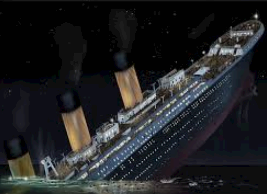

# Titanic-Machine-Learning-from-Disaster
END TO END MACHINE LEARNING MODEL

# OVERVIEW :

The sinking of the Titanic is one of the most infamous shipwrecks in history.
On April 15, 1912, during her maiden voyage, the widely considered “unsinkable” RMS Titanic sank after colliding with an iceberg.
Unfortunately, there weren’t enough lifeboats for everyone onboard, resulting in the death of 1502 out of 2224 passengers and crew.
While there was some element of luck involved in surviving, it seems some groups of people were more likely to survive than others.
In this challenge, we ask you to build a predictive model that answers the question: “what sorts of people were more likely to survive?” using passenger data 
(ie name, age, gender, socio-economic class, etc).

# Goal :

It is your job to predict if a passenger survived the sinking of the Titanic or not.
 you must predict a 0 or 1 value for the variable.Compare various model and choose best one
 
 # LIFE CYCLED FOLLOWED :
 
1) DATA ACQUISITION
2) EXPLAINATORY DATA ANALYSIS I.e EDA
3) DATA VISUALIZATION
4) DATA PREPROCESSING
5) FEAUTURE ENGINEERING
6) FEATURE SCALING
7) MODEL BUILDING
8) OPTIMIZATION
9) CONCLUSION
 
  # ALGORITHUMS IMPLEMENTED :
  
 1) KNeighborsClassifier
 2) LOGISTIC Regression
 3) SVM CLASSIFIER
 4) DecisionTreeClassifier
 5) RandomForestClassifier
 6) XGBClassifier
 7) BernoulliNB
 
 # METRICS USED :
 
 1) ACCURACY
 2) CONFUSION MATRIX
 3) CLASSIFICATION REPORT
 4) ROC CURVE
 
 # OPTIMIZATION USING GRID SEARCH CV FOR ALGORITHUMS:
 
 1) KNeighborsClassifier
 2) SVC Classifier
 3) RandomForestClassifier
 4) LogisticRegression
 
 # OPERATIONS PERFORMED :
 1) EDA ON ALL COLUMNS
 2) BUCKETING FOR NECESSARY COLUMNS
 3) DROPPING NULL VALUES CONSISTING  COLUMNS OF LARGER DEGREE.
 5) FINDING OUTLIERS
 6) PERFORMING CATEGORICAL AND NUMERICAL ANALYSIS 
 7) FEATURE SELECTION
 8) HYPER PARAMETER TUNING FOR OPTIMIZATION
 9) COMPARING ALL ALGORITHUM WORKING OF MODELS THROUGH A UNIFIED ROC CURVE.
 10) FINDING BEST FIT MODEL FOR DATA SET.
 
 
 
 
 
 

